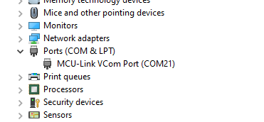

# NXP Application Code Hub

## P3H2x4x(I3C Hub Arduino) Applications running on FRDM-MCXN947 and FRDM-MCXA153

 This demo application provides driver (for P3H244x/P3H284x) and CLI based application of explore all the features provided by I3C hub on FRDM- MCXA153 and MCXN947.
 

### P3H2x4x block diagram

### Key features of P3H2x4x

- Two Controller Ports to connect to I3C or I2C/SMBus Controller devices: Controller Port 0 (CP0) and Controller Port 1 (CP1)
- Up to four/Eight Target Ports (TP), each port can be used to connect to I3C, I2C and SMbus devices.
- An SMBus Agent per each Target Port, each SMBus agent has access to the Register Map for 
Transmit/Receive Data buffers and SMBus agent control.
- A HUB Network/circuitry to communicate between Controller ports to Target Ports in a transparent bridge manner.
- A Multiplexer to connect one Controller port to the HUB Network.
- Integrated LDO regulators to provide two Target Port VCCIO voltage domains, two Controller Port VCCIO domains, and internal core logic power. The voltages supported are 1.0V, 1.2V or 1.8V.
- I3C IBI and hot join support.
- Four device variants:
    - **P3H2840**: 8 port hub - 8 TP with default configuration (Device Config #1, 8 Port version)
    - **P3H2440**: 4 port hub - 4 TP with default configuration (Device Config #1, 4 Port version)
    - **P3H2841**: 8 port hub - 8 TP with Debug configuration (Device Config #2, 8 Port version)
    - **P3H2441**: 4 port hub - 4 TP with Debug configuration (Device Config #2, 4 Port version)
- I/O latch-up current 100mA
- Operating temperature range TA: -40 oC to +85 oC.

#### Boards: FRDM-MCXN947 and FRDM-MCXA153
#### Categories: Bridge, Industrial 
#### Peripherals: I3C, I2C, SMBUS, GPIO 
#### Toolchains: MCUXpresso IDE 

## Table of Contents
1. [Hardware](#hardware)
2. [Software](#Software)
3. [Setup](#Setup)
4. [Pre-Requisites](#Pre-Requisites)
5. [Application Overview and Test Results](#applications-overview-and-test-results)
6. [Limitations](#Limitations) 
7. [FAQs](#faqs) 
8. [Support](#support)
9. [Release Notes](#release-notes)

## 1. Hardware

The needed hardware are:
1. P3H2x4x I3C Hub
2. FRDM-MCXA153 and MCXN947 baseboards
3. P3T1755TP temperature sensor (optional for testing external devices)
4. PCF2131 RTC controller (optional for testing external devices)
5. Jumper Wires
6. Mini/Macro USB cable
7. Personal computer

## 2. Software

- [IoT Sensing SDK (ISSDK) v1.8](https://nxp.com/iot-sensing-sdk) offered as middleware in MCUXpresso SDK for supported platforms
- [MCUXpresso IDE v11.9.0](https://www.nxp.com/design/design-center/software/development-software/mcuxpresso-software-and-tools-/mcuxpresso-integrated-development-environment-ide:MCUXpresso-IDE)

## 3. Setup
### 3.1 Step 1: Download and Install required Software(s)
- Install MCUXpresso IDE 11.9.0
- Download and Install [[MCUXpresso SDK v2.16.100 for FRDM-MCXN947](https://mcuxpresso.nxp.com/en/select)] and [[MCUXpresso SDK v2.14.2 for FRDM-MCXN153](https://mcuxpresso.nxp.com/en/select)] . Make sure to select ISSDK  middleware while building SDK.
- Install Git v2.39.0 (for cloning and running west commands).
- Install Putty/Teraterm for UART.
 
### 3.2 Step 2: Clone the APP-CODE-HUB
- Clone this repository to get the example projects:
- Change directory to cloned project folder: 
    cd dm-p3h2x4x-i3c-hub-demo-application
 
**Note:** If using windows to clone the project, then please configure filename length limit using below command
**git config --system core.longpaths true**

### 3.3 Step 3: Build example projects
- **For flashing code, connect type-C cable to J17 of FRDM-MCXN947, which is a MCU-debug link port.** 
- Open MCUXpresso IDE and select a directory to create workspace.
- Install MCXUpresso SDK 2.16.100 for FRDM-MCX947 or (drag and drop SDK zip into "Installed SDK" view) into MCUXpresso IDE.
- Go to "Quickstart Panel" and click on "Import Project(s) from file system".
- Select "Project directory (unpacked)" and browse to the cloned project folder.
- Select an example project and run.
- Right click on project and select build to start building the project.

## 4. Hardware Reworks and Pre-Requisites

There are some pre-requisites for the I3C hub which need to be kept in mind while using the application:

1. Rework needs to be done in both MCXA153 and MCXN947 baseboard for I3C protocol.
  * MCXA153- external add on jumper on baseboard ie., J20 and J21.
  
    

  * MCXN947- Shorting of 2-3 pins of SJ14 and SJ15 
  
    

2. To test I3C hub with FRDM-MCXA153, P3H2x4x need to be connected using jumper wires with the baseboard and with MCXN947, we can stack the shield board directly.

    

    

3. For our demo setup, Configurations for target ports in "P3H2x4x_config.h" file are as per below:

   * Target port(TP 0), On die temperature sensor, is configrued in SMBUS mode

   * TP 2, On die temperature sensor, is configured in I3C mode

   * TP 3 is configured for external I3C device(P3T1755TP)
    
    

      

   * TP 6 is configures external I2C device(PCF2131) (In case of P3H284x only)
    
    
   
      
   
   * TP 1 is configured for external SMBUS device(P3T1755TP)
    
    
    
      

   * TP 0 is configured for external SMBUS device(RTC-PCF2131) with FRDM-MCXA153 baseboard for IBI
  
    
   
      

4. If user wants to change the default configurations, Open the demo application, 
In I3C Hub folder, select "P3H2x4x_config.h" file and change the Macros as per choice.

    

5. To configure the Pull up, LDOs and IO-strengths of target and controller ports, use macros in "P3H2x4x_config.h" file.

    

6. To test IBI feature, Disable Hub network connections from 'P3H2x4x_config.h" file and enable the IBI for respective target port to which an external controller is connected.  

    

    

7. On shield board (P3H2x4x), make sure to keep the J34 and J20 jumper pins OPEN and SHORT the J35 jumper pin. 

8. Make sure to enable "SILICON_A0" macro in the demo application properties for selecting the AO version of P3H2x4x device.

    

9. Make sure to add "P3H2840", "P3H2841", "P3H2440", "P3H2441" Macros in the application properties and enable the respective board which you are using for testing and disable the rest other varients. 

    

10. In P3H2441 and P3H2841 series of shield boards, CP1 should be selected
by shorting 2-3 pins of JP9 & JP10 and JP2 & JP3 should be kept open. 

## 5.Applications overview and test results

 User needs to check the COM port after connecting USB cable between host PC and target board via device manager.

  

- Open PUTTY/Teraterm application installed on Windows PC with Baudrate 115200 and assigned COM port as mentioned in above step.

  

- Right click on project and select "Debug As", Demo application will run in interactive mode. When the demo runs successfully, the logs gets printed on the terminal.

## 5.1 Execution steps

**Main Menu will look like this**
- On boot, user need to set controller - Hub network connection by selecting either I2C or I3C. 

- NOTE: If I3C is selected, User needs to assign the dynamic address explicitly(eg. enter 30)

  

**Enter #1 to check on board temperature sensor in I3C mode on target port 2** 

- Enter #1 to select on board temperature sensor device 
- Enter #2 to select port 2
- Enter #2 to select I3C mode.
- Assign unique dynamic address to the temperature sensor.
- Read/write temperature sensor as per choice.
- Enter #5 to exit and return to main menu.

Note: Make sure, Controller-hub network is I3C. 

  

**Enter #2 to check external read/write in SMBUS mode using P3T1755TP device at target port 1** 

- User needs to select option #2 to select external device.
- Enter #3 to read/write any externally connected device.
- Enter static address as "4c" for P3T1755 device.
- Enter #3 to select smbus read/write
- Enter #1 to write the below shown details.
- Enter #2 to read the written data.
- Enter #3 to exit and return to main menu.

  

**Enter #4 to reset the HUB device.** 

- User needs to select option #4 or #5 to reset the I3C interface or hub device and re-configure the hub- controller network. 

  

**Re-configure the hub network in I2C mode** 

- After hub reset, Enter #1 to choose the Controller-Hub network as I2C mode. 

  

**Enter #1 for testing on die temperature sensor in Smbus mode on target port 0** 

- Enter #1 to select port 0.
- Enter #1 to select smbus mode.
- Read/write temperature sensor as per choice.
- Enter #5 to exit and return to main menu.

  

**Enter #2 to check external RTC device in I2C mode on target port 6 (Only for P3H284x variants)** 

- Enter #1 to select RTC device in I2C mode.
- Start the RTC and test the same as per choice.
- Enter #5 to exit and return to main menu.
- Note: Make sure, controller-hub network is I2C.

  

**Enter #3 to test the IBI at Target port 0** 

- Firstly, connect the RTC with controller device on target port 0

- Enter #1 to enable the IBI in Hub's terminal.

  

- Open a differnt putty/teraterm to make the communication between connected RTC and controller in RTC's terminal.
Enter #14 to write the data

  

- Enter #3 to check the IBI interrupt and the data in Hub's terminal.

  

## 6. Limitations
- For the "A0" version of P3H2x4x shield board, IBI is non-functional when HUB network is enabled. 
- Errata fix needs to be done for "A0" version of P3H2x4x board which is handled using "SILICON_A0" MACRO in the demo application
- I3C pin lines of MCXA153 is not present on its arduino header, so we need to connect it with P3H2x4x using external jumper wires. 
Due to this, we lowered the baudrates of OD mode to 400KHz and PP mode to 1MHz. 
CAUTION: Make stable connection and try not to disturb the setup once connected.

## 7. FAQs
No FAQs have been identified for this project.

## 8. Support
#### Project Metadata

<!----- Boards ----->

<!----- Categories ----->

<!----- Peripherals ----->

<!----- Toolchains ----->

Questions regarding the content/correctness of this example can be entered as issues within this gitHub repository.

>**Note**: For more general technical questions regarding NXP Microcontrollers and the difference in expected functionality, enter your questions on the [NXP Community Forum](https://community.nxp.com/)

## 9. Release Notes
| Version | Description / Update                           | Date                        |
|:-------:|------------------------------------------------|----------------------------:|
| 1.0     | Initial release on Application Code Hub        | Febuary 6th 2025 |
|
